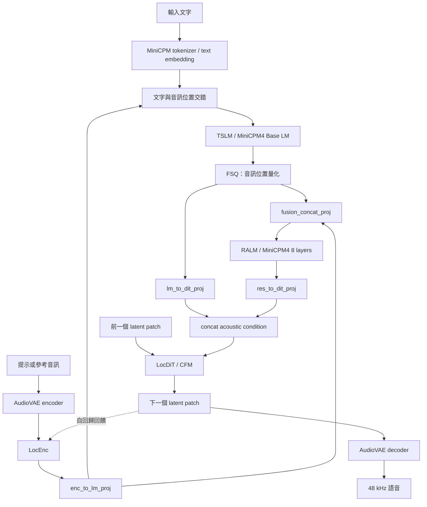
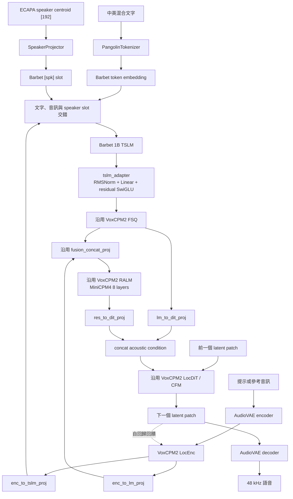

# BlueMagpie-TTS 與 Barbet 技術架構查核

日期：2026-07-31
狀態：依公開原始碼、模型 metadata、VoxCPM2 本機原始碼與作者提供的 Barbet HF 發布包查核

## 結論先行

原摘要的主方向成立，但用「Barbet 是全部護城河、TTS 只是 VoxCPM2 套殼」描述得太絕對。

較準確的說法是：

> BlueMagpie-TTS 以 Barbet 取代 VoxCPM2 的 Text-Semantic LM（TSLM），保留並再利用 VoxCPM2 的 LocEnc、FSQ、8-layer Residual Acoustic LM（RALM）、LocDiT／CFM 與 AudioVAE；真正新增的技術不只是包裝程式，而是跨 hidden space 的 adapter、雙向投影、speaker conditioning，以及讓新 TSLM 與既有聲學堆疊重新對齊的訓練工作。

Barbet 確實是專案中最具獨立再利用價值的資產：它是 1.088B 參數、混合 global attention／sliding attention／Mamba2 的 decoder-only causal LM，並使用針對正體中文、台灣文本及多語內容設計的 PangolinTokenizer。但 BlueMagpie 的 TTS 成果不能只歸因於 Barbet；VoxCPM2 聲學權重、橋接設計、對齊訓練及條件控制同樣是必要部分。

逐 tensor 查核後，可以把判斷再收斂成三句：

1. **原摘要對「聲學底盤沿用」的判斷比預期更接近事實。** 最新成品中的
   LocEnc、RALM、LocDiT、FSQ、主要投影與 AudioVAE 都和原始 VoxCPM2 權重
   逐值相同；只有 stop predictor 和新增控制路徑有變。
2. **但它不是不需訓練的 checkpoint 拼接。** Barbet、兩側 bridge、speaker
   projector 與 TTS special tokens 必須經過蒸餾／TTS 對齊；不同 BlueMagpie
   發布 checkpoint 間，Barbet 的 380 個 tensors 全部都在變化。
3. **產品整合與自行換腦是兩件事。** 把完整 BlueMagpie checkpoint 接成
   VoxCPM360 第二後端不需訓練；只拿 raw `barbet-1b-base` 替換 VoxCPM2
   `base_lm` 則一定需要重新對齊訓練。

本文件的判定優先順序是：本機 tensor／runtime 實測 > 固定 revision 原始碼 >
官方 release metadata／model card > 部落格敘述。官方未公開的資料配方、訓練帳目
與權重授權不以推測補齊，統一列在「仍待作者材料」。

## 原摘要需要修正的四個重點

### 1. 不是只保留 LocDiT

BlueMagpie 保留的 VoxCPM2 元件至少包括：

- Local Encoder（LocEnc）
- Scalar Quantization／FSQ
- 8-layer Residual Acoustic LM（RALM，MiniCPM4）
- 多組投影與 fusion layer
- stop predictor
- LocDiT／UnifiedCFM
- AudioVAE V2

因此「Barbet → Bridge → LocDiT」只能當高階比喻，不能當底層架構圖。VoxCPM2 官方也將流程概括為 `LocEnc → TSLM → RALM → LocDiT`。

### 2. `pytorch_model.bin` 大不是因為 bridge 程式碼

Hugging Face API 顯示 BlueMagpie 的檔案大小為：

| 檔案 | 精確大小 | 內容 |
|---|---:|---|
| `pytorch_model.bin` | 7,800,079,543 bytes | Barbet、RALM、LocEnc、LocDiT、adapter、projection、speaker projector 等非 AudioVAE 權重 |
| `audiovae.pth` | 376,972,749 bytes | AudioVAE 權重 |
| `speaker_centroids.pt` | 3,311 bytes | 目前多語者 centroid 表 |
| 舊版李宏毅 centroid | 2,691 bytes | 舊版單一語者 centroid 表 |

Python bridge 程式碼只有數十 KB，不會被塞進 `pytorch_model.bin`。最新 checkpoint
的主模型共有 1,949,955,324 個參數，而且檔案內所有 tensors 都以 FP32 儲存；
這才是接近 7.8 GB 的直接原因。模型載入後才把非 AudioVAE 模組轉成設定的推論
dtype。若只看「程式碼多寡」無法解釋模型檔大小。

### 3. Speaker centroid 不是直接掛到 LocDiT

BlueMagpie 的 centroid 是 192 維 ECAPA speaker embedding。實作路徑是：

```text
speaker centroid [192]
  → SpeakerProjector
  → Barbet hidden size
  → 注入 [spk] token 位置
  → Barbet／TSLM
  → adapter／RALM／LocDiT
```

所以「推論時把 `.pt` 強制掛載到 LocDiT」不符合程式碼。它是高層語意／條件序列的一部分，影響會經過整個後續聲學生成鏈。

另外，指定 centroid 和直接提供 reference audio 是不同路徑，不宜統稱成同一種「簡單掛載」。

### 4. 公開材料能證明 Megatron 來源，但不足以完整證明從零訓練流程

作者提供的 `pretrained_models/barbet-1b-base` 發布包內有明確轉換紀錄：

- source checkpoint：`retry29_early_pair_retained/..._i128`
- source iteration：128
- 格式：Megatron checkpoint → single BF16 safetensors
- Megatron tensors：310
- HF tensors：380
- 參數量：1,088,124,920
- Megatron／HF next-token parity：通過發布 gate

因此可以確定這份權重來自 Megatron 格式的訓練 checkpoint。

但這個發布包與公開 Barbet repo 都未包含完整 pretraining data manifest、初始化來源、optimizer、RNG state、raw distributed shards 或完整訓練 launch config。故以下說法應分級：

| 敘述 | 查核判定 |
|---|---|
| Barbet 是獨立的 custom architecture，不是 Llama／Qwen 的 HF 類別改名 | 可由 config、tensor shapes 與 modeling code確認 |
| 權重由 Megatron checkpoint 匯出 | 可由 `conversion_report.json` 確認 |
| Barbet 是 base model，而非 instruction-tuned assistant | model card 明確確認 |
| 完整模型從 random initialization 開始預訓練 | 與現有證據一致，但發布包不足以獨立重現或最終證實 |
| 使用龐大 GPU 叢集、投入特定算力規模 | 目前參考材料沒有可核對的硬體與訓練帳目 |

## Barbet 1B 實際規格

作者提供的發布包與公開 config 一致：

- 本機位置：`pretrained_models/barbet-1b-base`
- `model.safetensors` SHA-256：
  `715ec78abce960bf1cd9357c4fd2258873a188e71a5de84f27f8015ada3bd45d`
- SHA-256 與作者提供的 `release_manifest.json` 一致

| 項目 | 規格 |
|---|---:|
| Parameters | 1,088,124,920 |
| Weight dtype | BF16 |
| Hidden size | 1,536 |
| Intermediate size | 5,120 |
| Logical layers | 28 |
| Global-attention layers | 7 |
| Sliding-window attention layers | 14 |
| Mamba2 layers | 7 |
| Attention heads / KV heads | 16 / 2 |
| Sliding window | 8,192 |
| Padded vocabulary size | 114,944 |
| Base BPE vocabulary | 114,688 |
| Effective tokenizer length | 114,822 |
| Runtime context config | 256K |
| 穩定發布 claim | 32K exact synthetic NIAH |
| 1M config | 4× linear RoPE 外推；不是原生 1M 訓練 |

28 層的排列是重複的：

```text
global attention → sliding attention → sliding attention → Mamba2
```

這個 pattern 重複七次。它不是純 Transformer，也不是純 Mamba。

PangolinTokenizer 是獨立發布的 byte-level BPE tokenizer，面向正體中文、台灣文本、多語、逐字稿與 OCR 類文本。PangolinBench 可支持 tokenizer efficiency 的比較，但不等同於 TTS code-switching 品質證明。

## 原始 VoxCPM2 的較完整架構



原始 VoxCPM2 不是單一「CPM 文字腦 → diffusion decoder」。TSLM 與 RALM 分工：前者處理文字語意與高層聲學規劃，後者補足細粒度 acoustic residual，再共同條件化 LocDiT。

## BlueMagpie-TTS 的實際「換腦」位置



精確地說，被替換的是 VoxCPM2 的 TSLM／`base_lm`，不是整個聲學生成系統。

## 成品 checkpoint 的逐 tensor 稽核

公開程式只能證明「初始化時」從 VoxCPM2 載入聲學模組。為確認成品是否又對聲學
模組做了 full fine-tune，本次直接比較：

- BlueMagpie：HF revision `4c2c5b...` 的 `pytorch_model.bin`
- VoxCPM2：HF revision `bffb3df...` 的 `model.safetensors`
- AudioVAE：兩個 revision 各自的 `audiovae.pth`

主模型共有 323 個同名、同 shape 的 VoxCPM2 tensors。逐值比較結果：

| 模組 | tensors | 與原始 VoxCPM2 的結果 |
|---|---:|---|
| LocEnc／`feat_encoder` | 112 | 全部 exact equal |
| RALM／`residual_lm` | 73 | 全部 exact equal |
| LocDiT／`feat_decoder` | 123 | 全部 exact equal |
| FSQ | 4 | 全部 exact equal |
| `enc_to_lm_proj` | 2 | 全部 exact equal |
| `lm_to_dit_proj` | 2 | 全部 exact equal |
| `res_to_dit_proj` | 2 | 全部 exact equal |
| `fusion_concat_proj` | 2 | 全部 exact equal |
| stop predictor | 3 | 全部有變更 |

AudioVAE 另有 312 個 tensors，也全部逐值 exact equal。兩個 `audiovae.pth`
檔案的整檔 hash 不同，是序列化封裝差異，不是神經網路權重差異。

因此對最新可取得成品，可以下比「沿用架構」更強的結論：

> VoxCPM2 的 LocEnc、RALM、LocDiT、FSQ、主要投影與 AudioVAE 不只是沿用
> architecture，而是保留原始 checkpoint 的逐值相同權重；被訓練改動的是
> Barbet／bridge／speaker 路徑、stop predictor，以及最新版本新增的控制頭。

主模型參數占比如下：

| 區塊 | 參數量 | 主模型占比 |
|---|---:|---:|
| Barbet `base_lm` | 1,088,124,920 | 55.80% |
| 逐值未改的 VoxCPM2 主幹（不含 AudioVAE） | 814,060,096 | 41.75% |
| `tslm_adapter` | 28,317,184 | 1.45% |
| `enc_to_tslm_proj` | 1,574,400 | 0.08% |
| `speaker_projector` | 296,640 | 0.02% |
| 其餘 stop／duration／continuation／speaker injection 控制 | 約 17.6M | 約 0.90% |

「聲學底盤高度沿用」因此是可由 tensors 證明的事實；但 bridge 參數占比小，不代表
訓練工作可省略。沒有正確對齊的小模組，兩個大模型仍無法共同產生可用語音。

### Barbet 在 TTS checkpoint 中確實有變動

作者提供的最新版 Barbet base 是 Retry29 iteration 128。它和最新 BlueMagpie
內的 380 個 `base_lm` tensors 全部不同；但因 BlueMagpie 可能起始於較早的 Barbet
base revision，不能只用這組比較量化 TTS fine-tune 的 delta。

更直接的證據是三個已快取 BlueMagpie 發布 checkpoint 之間的比較：

| 比較 | Barbet 380 tensors | VoxCPM2 聲學主幹 | bridge／speaker |
|---|---|---|---|
| `step_0003900` → `step_0006000` | 380 全部改變 | 全部 exact equal | 全部改變 |
| `step_0006000` → `step_0000049` | 380 全部改變 | 全部 exact equal | 全部改變，另新增控制模組 |

這表示發布過程不是「固定 Barbet base，只訓練一個 linear bridge」；Barbet 本體也在
TTS checkpoint 間持續變化。由於較早 Barbet base 權重目前不可取得，尚不能把
每個變化完全拆分為「更換 base revision」與「TTS fine-tune」，但至少可以排除
「目前作者給的 Barbet base 等同 BlueMagpie TSLM 權重」。

## 技術價值判讀

### Barbet 的價值

- 有獨立 base LM 權重，不綁死 TTS，可延伸到 ASR、OCR、長文本或其他 multimodal front end。
- 混合 global／sliding attention／Mamba2 是實際模型結構，不是 adapter 微調能增加的表面改動。
- PangolinTokenizer 與台灣文本導向的 vocabulary 是獨立資產。
- Megatron → HF 的轉換、parity gate、長上下文測試與發布 manifest 顯示出一定程度的 ML infra 能力。

### BlueMagpie 的價值

- 成功把 hidden size、cache 行為、token vocabulary 和表示空間不同的 Barbet 接上 VoxCPM2。
- `tslm_adapter` 不是單純 reshape，而是 RMSNorm、線性投影與可訓練 residual SwiGLU blocks。
- 同時處理 LocEnc → Barbet、Barbet → VoxCPM semantic space 和 speaker centroid → Barbet 三條對齊路徑。
- 保留 VoxCPM2 下游預訓練權重的可載入性，降低從零訓練聲學模型的成本。
- 額外提供 streaming、continuous batching、MLX 及 voice-cloning 工作流；這些是工程產品價值，不只是 UI 套殼。

### 公開程式能證明的訓練方式

`loading.py` 明確定義三個 stage：

| stage | trainable modules | 公開說明 |
|---|---|---|
| `bridge` | `enc_to_tslm_proj`、`tslm_adapter` | 對原始 VoxCPM2 TSLM 做 hidden-space distillation，或直接用 diffusion loss |
| `tslm` | bridge、Barbet、speaker projector | VoxCPM2 聲學主幹凍結，學習 TSLM 與 speaker conditioning |
| `full` | 除 AudioVAE 外全部 | 允許端到端更新 |

組裝程式也明確表示 bridge 永遠是新初始化，五個 TTS special-token embedding rows
會重新初始化。training forward 公開了 diffusion loss、stop loss 與 pre-FSQ
`tslm_hidden` 蒸餾輸出。

但公開 repo 沒有 dataset loader、optimizer、training loop、loss 權重、launch
config 或實際 checkpoint selection 腳本。故三階段是可查核的設計介面，不等於
可完整重現的訓練 recipe。逐 tensor 結果顯示公開成品的 VoxCPM2 聲學主幹實際保持
凍結，只有 stop predictor 例外；至少最新發布並未留下 `full` stage 更新聲學主幹
的結果。

### 依賴 VoxCPM2 的部分

- 高品質連續音訊 latent
- RALM 的細粒度 acoustic modeling
- LocDiT／CFM diffusion sampling
- AudioVAE V2 的 48 kHz waveform reconstruction
- 原有投影、stop prediction 與生成流程

因此最公平的總結是：

> Barbet 是最具獨立性的核心資產；BlueMagpie 是有實質訓練與模型整合工作的 TSLM transplant；底層聲學能力則高度建立在 VoxCPM2 之上。

## 評測數字的版本風險

不同文件目前出現不同內部評測數字：

- 2026-06-23 部落格：CER 4.81%、WER 5.36%
- 後續 GitHub README：centroid CER 7.44%、reference audio CER 8.99%
- 最新 HF `step_0000049` controlled 30 texts × 5 seeds：
  centroid CER 15.37%、WER 41.48%；speaker-reference embedding CER 13.39%、WER 33.05%
- 最新 HF quality rerank（每句 10 candidates）：
  selected CER 1.14%、WER 1.86%，但未參與選擇的獨立 ASR 測得 CER 6.83%、WER 6.78%

這些數字可能來自不同 checkpoint、測試集切片、speaker conditioning 或推論 policy，不能直接串成單一進步曲線。任何正式比較都應固定：

1. checkpoint SHA／step
2. 測試集與正規化規則
3. ASR evaluator
4. centroid／reference audio 模式
5. seed 數量
6. 是否使用 retry 或 candidate reranking

在這些條件未對齊前，只能引用為「各版本內部測試」，不宜當公開 benchmark。
尤其 10-candidate rerank 是 test-time selection，不是 checkpoint 本身變好十倍；
不能拿 selected CER 和單次生成的其他系統直接比較。最新 model card 也明說
evaluation set 與 training data 刻意不公開，因此目前無法做獨立重現或資料洩漏稽核。

## 公開程式與最新權重存在版本錯配

截至 2026-07-31，可固定下列版本：

| 項目 | revision |
|---|---|
| OpenFormosa/BlueMagpie-TTS 公開 GitHub | `ce384c8cc54efea1aaba7b9f1d7ded6c1c99aa9a` |
| OpenFormosa/BlueMagpie-TTS 最新 HF 權重 | `4c2c5bcb7e87041a8eaba9df5821ec7a3e1d0c6c` |
| BlueMagpie 所註明的 VoxCPM 來源 | `856d2fc2a853656e324e491706d1e8a6bfac361c` |

最新 HF `config.json` 包含公開 OpenFormosa GitHub 程式不存在的欄位：

- `ref_audio_bottleneck`
- `ref_audio_summary_tokens`
- `speaker_step_injection`
- `speaker_step_injection_init`
- `continuation_adapter_dim`
- `continuation_dit_adapter_dim`
- `continuation_dit_ramp_steps`

最新 HF model card 也使用公開 repo 沒有的 `speaker_embedding_from_wav`、`stop_threshold`、
`stop_consecutive` 與兩個生成腳本，安裝指令則改指向目前無法公開存取的
`voidful/BlueMagpie-TTS`。

本機正在運行的 `bluemagpie-tts:latest` Docker 服務提供了實際交叉驗證。它使用
`CreateIntelligens/BlueMagpie360-TTS` fork 的舊版模型程式，載入最新
`4c2c5b...` checkpoint 時共有 18 個 unexpected weights。log 只列出前 8 個：

```text
stop_context_gate
spk_vox_gate
spk_dit_gate
stop_context_proj.weight
duration_head.0.weight
duration_head.0.bias
duration_head.2.weight
duration_head.2.bias
```

其餘 10 個屬於 continuation adapter、speaker-to-Vox／DiT injection 等模組。
服務仍可完成合成，故這不是「完全不能執行」；但舊程式沒有使用最新 checkpoint
的完整 speaker、stop 與 duration 路徑。正式評測、再訓練或產品部署不能把這種
部分載入視為版本完全相容。應取得與 `4c2c5b...` 配對的原始碼，或明確 pin 回
和現有程式相符的 `78b3cbe95ed6f3097a07b5894444998c3f879075`
（`step_0006000`）checkpoint。既有容器曾成功以該版本載入，且其 715 個主模型
tensors 與公開架構相符。

## 對 VoxCPM360 的實務意義

目前作者提供的 `pretrained_models/barbet-1b-base` 只有 Barbet HF base model，沒有 BlueMagpie TTS bridge 或完成對齊的 TTS checkpoint。它不能直接替換本專案的 `VoxCPM2Model.base_lm` 後立刻生成可用語音。

### 「需不需要訓練」的明確答案

| 使用方式 | 是否需要再訓練 | 判定 |
|---|---|---|
| 使用完整、程式版本配對的 BlueMagpie TTS checkpoint 推論 | 不需要 | bridge、speaker projector 與聲學堆疊已包含已訓練權重 |
| 只把作者提供的 Barbet 1B 換進原始 VoxCPM2 | 需要 | hidden size、詞表、模型結構、cache 與表示空間均不同 |
| 把本專案現有 LoRA 整包載入 BlueMagpie | 不可直接載入 | LoRA 同時包含不相容的原始 `base_lm` 權重 |
| 只移植 LoRA 中 RALM／LocDiT 部分 | 可能，但必須做程式化篩選與驗證 | 兩者沿用相同 VoxCPM2 模組；仍需檢查 checkpoint 版本、key 與 shape |
| 想保留本專案語者／風格資料並使用 BlueMagpie | 建議重新微調 | 從完整 BlueMagpie checkpoint 做專用 LoRA／fine-tune，而不是替換 Barbet |
| 只需要 voice cloning | 不一定 | centroid 或 reference speaker embedding 可能已足夠，不會自動繼承現有 LoRA 的發音與風格能力 |

### 本專案 LoRA 的實際相容性稽核

`checkpoints/balanced_lora_512_5epochs_best/latest/lora_weights.safetensors`
共有 384 個 LoRA tensors：

| tensor 群組 | 數量 | shape／架構判定 | 對 BlueMagpie |
|---|---:|---|---|
| `base_lm.*` | 224 | 28-layer MiniCPM4，input hidden 2048 | 不相容；BlueMagpie 已換成 1536-d Barbet hybrid LM |
| `residual_lm.*` | 64 | 8-layer MiniCPM4，hidden 2048 | 有條件可移植 |
| `feat_decoder.estimator.*` | 96 | 12-layer LocDiT，hidden 1024 | 有條件可移植 |

LoRA config 是 `enable_lm=true`、`enable_dit=true`、`enable_proj=false`。本專案
`_apply_lora()` 的 `enable_lm` 同時把 LoRA 注入 `base_lm` 與 `residual_lm`，
所以「LM LoRA」不是單一可整體轉移的區塊。整包直接載入會在 Barbet
`base_lm` 發生 layer type 與 shape mismatch。

若要實驗性移植，必須：

1. 丟棄全部 `base_lm.*` LoRA tensors。
2. 僅保留 `residual_lm.*` 與 `feat_decoder.estimator.*`。
3. 在目標 BlueMagpie 版本注入相同 `r=32`、`alpha=32` 的 LoRA module。
4. 對每個 key 做名稱、基底 linear shape 與 A/B tensor shape 的逐項檢查。
5. 在固定文字、speaker、seed 與推論參數下和未移植 BlueMagpie 做 A/B。
6. 再以 BlueMagpie 的訓練目標微調；不能假設原 VoxCPM2 LoRA 的增益會原樣保留。

這種選擇性移植保留的是 RALM／LocDiT 學到的聲學偏移，不會把原 MiniCPM
`base_lm` 學到的文字發音規劃搬進 Barbet。

### 本機 Barbet smoke test

作者提供的本機 Barbet package 已使用現有 `bluemagpie-tts` image 做無網路、
唯讀 Docker 驗證：

- 成功載入為 `BarbetForCausalLM`
- 參數量：1,088,124,920
- vocabulary：114,944
- hidden size：1,536
- Pangolin tokenizer 可正常切分中英混合句
- 8-token forward 輸出 shape 為 `[1, 8, 114944]`
- logits 全為 finite

因此本機 Barbet 權重本身可用；尚未具備的是 TTS bridge／alignment，而不是
Barbet 檔案損壞或無法載入。

若要在 VoxCPM360 使用 Barbet／BlueMagpie，有三條路：

### 路線 A：把既有 BlueMagpie Docker 接成第二後端（建議先做）

這條路不需要訓練，也不需要把兩套 Python／CUDA runtime 塞進同一個 process。
目前已實測：

- `bluemagpie-tts` 服務在 host port `1981` 提供 `/health`、`/api/synthesize`、
  `/api/synthesize/clone` 與 `/api/synthesize/stream`。
- `voxcpm_app` 容器可透過 Docker host gateway 存取該服務，health 回傳
  `model_loaded=true`。
- VoxCPM360 容器已有 `httpx` 和 `requests`，無須增加 HTTP client dependency。

正式整合不應硬編碼 gateway IP；應將兩個服務加入同一個 Compose network，
以 `BLUEMAGPIE_URL=http://bluemagpie:8000` 連線。現有 `app.py` 的 model dropdown
實際上是 LoRA selector，建議另加「引擎」選擇：

```text
TTS 引擎
├── VoxCPM2
│   └── 基礎模型／既有 LoRA selector
└── BlueMagpie
    └── 內建 speaker／reference audio clone
```

應以統一 backend protocol 封裝：

```text
synthesize(text, reference_audio, cfg, steps, seed, model_selection)
    -> (sample_rate, waveform)
```

VoxCPM2 backend 維持現有 Nano-vLLM 與 LoRA registry；BlueMagpie backend 呼叫 REST
API。BlueMagpie 不支援 VoxCPM2 的 control instruction、prompt transcript 或現有
LoRA，UI 必須依 backend 隱藏不適用欄位，不能默默忽略。

這是「整合 BlueMagpie 成品到本專案」，不是「把 raw Barbet base 塞進 VoxCPM2」。
前者免訓練，後者仍必須訓練。

### 路線 B：把 BlueMagpie runtime 內嵌成第二個本機模型

可以把 BlueMagpie package 納入同一 repo，再由本專案直接載入完整 TTS checkpoint。
它同樣不需要重新訓練，但目前不優先，原因是：

- 現有主服務使用 Nano-vLLM-VoxCPM，BlueMagpie 公開版使用獨立 PyTorch runtime。
- 兩套模型的依賴、cache 與生成 API 不同。
- 同 process 載入會把錯誤隔離、升級與 GPU 記憶體管理綁在一起。
- 公開 BlueMagpie source 與最新 checkpoint 尚未配對。

若日後需要單容器部署，應先有 backend abstraction 與固定版本的整合測試，再把
HTTP backend 換成 in-process backend；不應一開始直接修改 `VoxCPM2Model`。

路線 A／B 都必須先選擇：

1. 取得與最新 `4c2c5b...` 配對的作者原始碼；或
2. 使用公開程式並 pin `78b3cbe...`（`step_0006000`）。

另需確認 BlueMagpie model weights 的 `other` license 是否允許預定用途。

### 路線 C：在本專案自行做 Barbet TSLM transplant

至少需要：

1. 納入 PangolinTokenizer 與 TTS special tokens。
2. 實作 Barbet 的 prefill／stepwise cache 介面。
3. 新增 `enc_to_tslm_proj`、`tslm_adapter` 與 speaker projector。
4. 保留並正確載入 VoxCPM2 的 RALM、LocEnc、LocDiT、FSQ 與 AudioVAE 權重。
5. 先做 hidden-space／teacher distillation 或其他 representation alignment。
6. 再以授權語音資料做 TTS 訓練與 speaker-conditioning 訓練。
7. 固定 checkpoint 與評測 protocol，和原始 VoxCPM2 做 A/B。

這不是單純的 checkpoint key rename。若目標是產品驗證，路線 A 最合理；若目標
是單容器包裝，待 A 驗證後再走 B；若目標是掌握訓練能力與建立自有台灣 TTS，
才走 C。

## 仍待作者材料才能確認的項目

- Barbet 是否從 random initialization 開始，以及任何 warm start／continued pretraining 來源。
- 完整資料配方、token 數、語言比例與授權。
- Megatron parallelism、GPU 型號／數量、訓練時間及總 FLOPs。
- PangolinTokenizer 的完整訓練 corpus 與重現腳本。
- BlueMagpie 實際各 stage 的步數、loss 權重、optimizer、資料量與 checkpoint selection；公開程式只有 stage freezing 規則。
- BlueMagpie 各 release 使用的精確 Barbet base revision；這是區分 base 更新與 TTS fine-tune delta 的必要基線。
- 最新 HF revision `4c2c5b...` 所對應、目前未公開的完整 source commit。
- Barbet 與 BlueMagpie 權重的完整授權條款；目前 metadata 只有 `license: other`。

## 本機部署安全觀察

現有 BlueMagpie Docker 的環境變數與 Git remote URL 含明文存取權杖。權杖值不應
出現在文件、log 或 issue；建議立即在對應平台撤銷／輪替，將 Git remote 改成不含
credential 的 URL，並改用 Docker secret、credential helper 或只讀 deploy token。
這不影響上述模型架構判定，但屬於獨立且高優先的部署風險。

## 參考來源

- [OpenFormosa：BlueMagpie-TTS 技術介紹](https://openformosa.com/blog/2026/06/23/bluemagpie-tts/)
- [OpenFormosa/BlueMagpie-TTS](https://github.com/OpenFormosa/BlueMagpie-TTS)
- [BlueMagpie-TTS Hugging Face 模型](https://huggingface.co/OpenFormosa/BlueMagpie-TTS)
- [OpenFormosa/Barbet](https://github.com/OpenFormosa/Barbet)
- [Barbet 1B Base Hugging Face 模型](https://huggingface.co/OpenFormosa/barbet-1b-base)
- [OpenFormosa/PangolinTokenizer](https://huggingface.co/OpenFormosa/PangolinTokenizer)
- [OpenFormosa/PangolinBench](https://github.com/OpenFormosa/PangolinBench)
- [OpenBMB/VoxCPM](https://github.com/OpenBMB/VoxCPM)
- [VoxCPM2 Technical Report](https://arxiv.org/abs/2606.06928)
- 本機原始碼：[VoxCPM2 model](../src/voxcpm/model/voxcpm2.py)
- 作者提供的發布包：`pretrained_models/barbet-1b-base`
